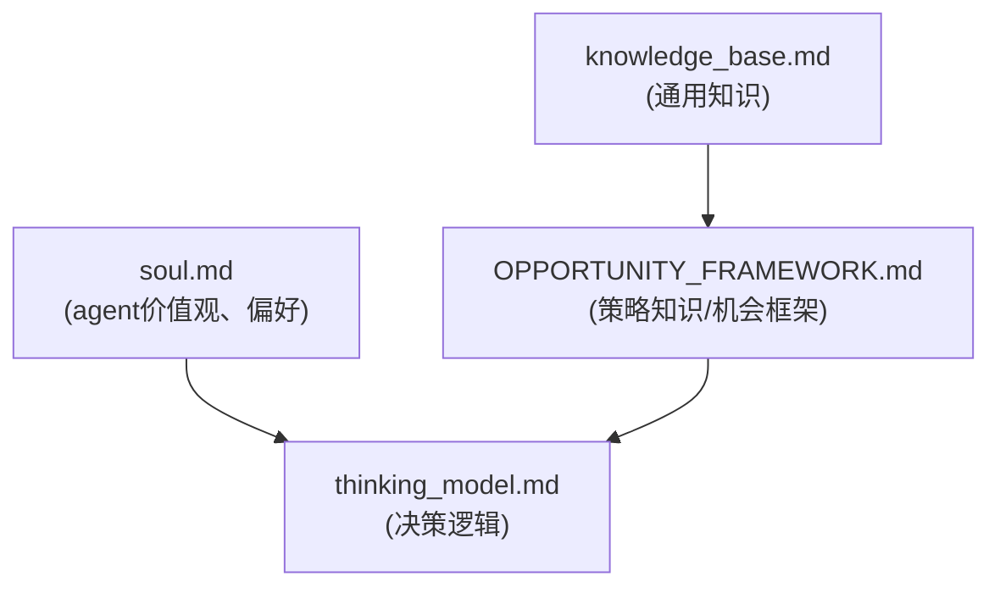

invest-agent



侧重点：Agent 的身份、定位、目标与行为风格

文件结构
```
invest-agent/
│
├─ AGENT.md                 # Agent整体身份与能力概览
├─ identity.md              # 角色定位、职责范围、交互能力
├─ soul.md                  # 投资风格、风险偏好、价值观约束
│
├─ skill/
│   ├─ market_map.md        # 市场信息结构、行业层级、标的/信号图谱
│   └─ knowledge_base.md    # 投资相关知识、公式、规则、经验条目
│
├─ algorithm/
│   ├─ thinking_model.md    # 决策逻辑、推理流程、优先级
│   └─ OPPORTUNITY_FRAMEWORK.md  # 机会识别方法、触发条件、风险收益框架
│
└─ memory/
    ├─ OPPORTUNITY_STATE.md # 当前机会状态、评分、处理阶段
    └─ MEMORY.md            # 历史事件、决策记录、经验积累

```

各个文件说明  
1. 身份与核心信息类
文件：AGENT.md、identity.md、soul.md
```
AGENT.md
核心目标：定义整个 agent 的整体身份与功能定位
核心内容：
名称、类型、版本
能力概览（skill类模块链接）
行为模式/工作风格
高层目标与任务范围
呈现形式：简介 + 列表 + 关联模块链接
identity.md
核心目标：明确 agent 的“角色身份”
核心内容：
Agent 的职责与权限范围
核心特征（比如市场分析专家、内容挖掘专家）
交互能力与适用场景
呈现形式：属性表 + 简述
soul.md
核心目标：定义 agent 的“内在思维风格与价值观”
核心内容：
推理偏好（逻辑、直觉、概率）
风险偏好（保守、均衡、激进）
决策优先级和价值观约束
长期行为倾向与使命感
呈现形式：描述性文字 + 行为规则示例
```
