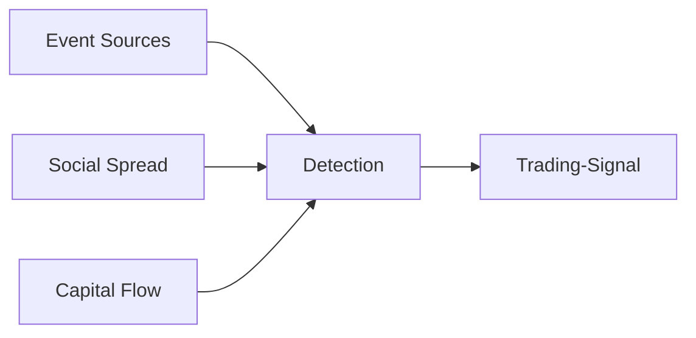
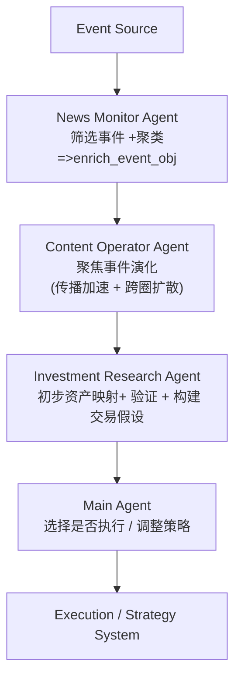

## How an event(data) has tradable value:
文档帮助理解信息传播的过程和介入时机




## An life status of an event:
```flowchart
Phase 1 研究 / 弱信号 
Phase 2 专家讨论 
Phase 3 事件催化 (重点关注)
Phase 4 扩散 
Phase 5 共识（时机已晚）
```
## Data essential types
```flowchart
Idea content yard  \twitter -- narrative  
Knowledge Market \google\bilibili  -- deep insign  
Behavior Ma rket  \taobao\pingduoduo -- real demand  
Expectation Market  *Polymarket** -- capital flow in
```
## Data source types:
```flowchart
entity_type:
account   → KOL / 人 / 机构账号
webpage   → 页面
api       → 数据接口
dataset   → 数据集
```
## Event classify
```flowchart
Policy Event
Supply Shock
Demand Shock
Liquidity Event
Reputation Crisis
Technology Breakthrough
Macro Trigger
```
## Event-driven multi-expert system workflow

