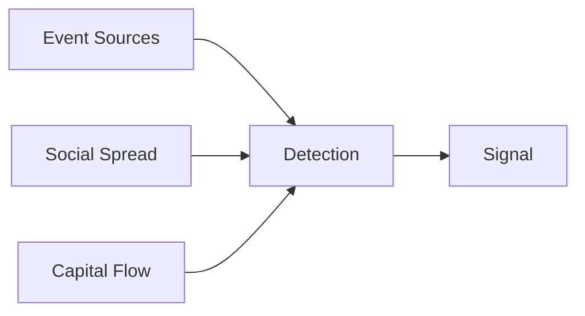

## how the signal has value:

## an life status of an event:

Phase 1 研究 / 弱信号 
Phase 2 专家讨论 
Phase 3 事件催化 
Phase 4 扩散 
Phase 5 共识（已经晚了）

## source types

Idea content yard  \twitter -- narrative  
Knowledge Market \google\bilibili  -- deep insign  
Behavior Ma rket  \taobao\pingduoduo -- real demand  
Expectation Market  *Polymarket** -- capital flow in

## event types

Policy Event
Supply Shock
Demand Shock
Liquidity Event
Reputation Crisis
Technology Breakthrough
Macro Trigger

## Event-driven multi-expert system

Event Source
   │
   ▼
News Monitor Agent
   │  (筛选事件 + 初步资产映射)
   ▼
Content Operator Agent
   │  (检测传播加速 + 跨圈扩散)
   ▼
Investment Research Agent
   │  (验证 + 构建交易假设)
   ▼
Main Agent (你)
   │  (选择是否执行 / 调整策略)
   ▼
Execution / Strategy System