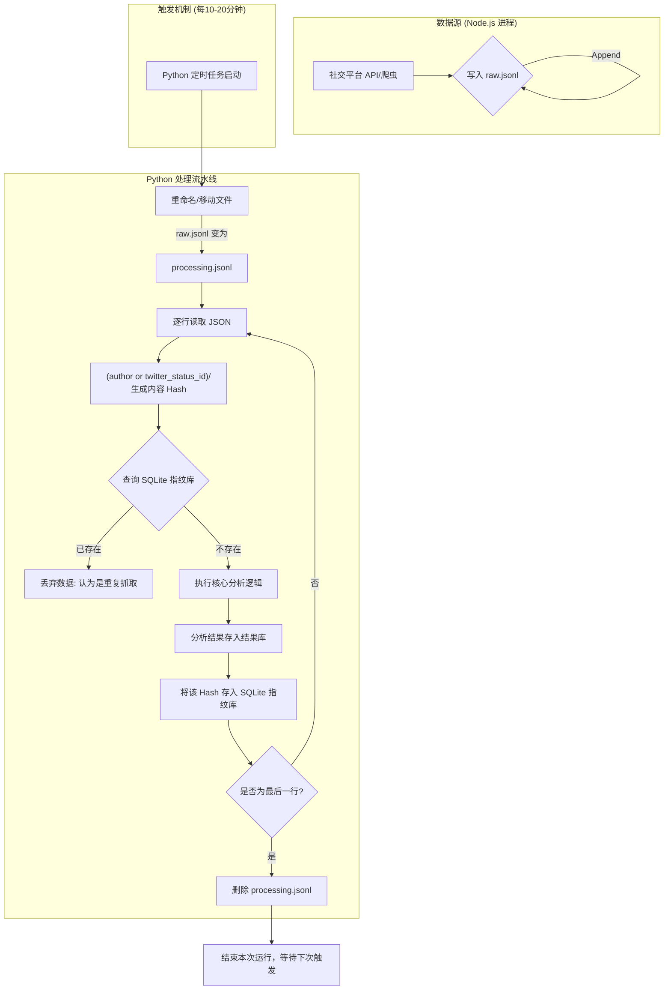

```
   news-analysis/
        │ 
        └── data/    
           ├── memory/   # Node.js 爬虫只管往这里写，文件命名格式为 raw_timestamp.jsonl
           │     └── rawdata.jsonl
           │  
           ├── processing/   # Python 脚本处理前，先把文件移到这里
           └── archive/   # 处理过的原始数据文件合并,按日期归档
```
原子化数据移交过程
		

