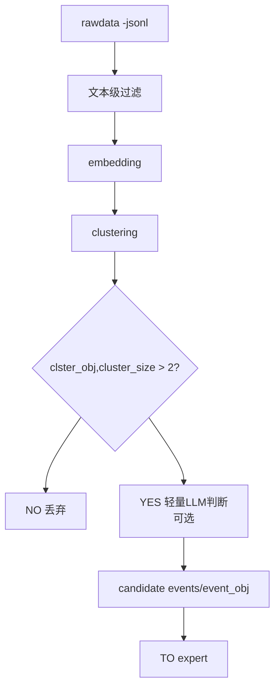

## 数据预处理简要说明
目前我们的Fetcher类已经解决了原始数据的抓取问题。接着要进行进一步的预处理，  
才能得到符合我们要求的enrich_event_obj:  

```flowchart
rawdata.jsonl（原始数据）
轻量筛选（太短 / 无实体 / 重复）
嵌入 + 聚类 → cluster_obj
cluster_obj → event_obj（最小结构化对象）
对 event_obj 调用 LLM summary → 输出高价值候选事件
expert agent 分析/洞察/打分/生成 impact_score
```
## 技术处理的侧重

第一：一开始抓取数据的时候要尽量保留原始数据的完整
以append oneline into jsonl的的形式获取和增加原始数据，  
保存到memory\raw_datexxxx.jsonl

第二：必须“稳定” ，需要对原始数据进行初步筛选
技术方案是，压缩信息（embedding + cluster）

丢弃无关和重复内容

## 步骤细节
---------------------------
***python 去除噪音***
```code
if:
    太短（<20字）
    or 无实体（无公司/国家/行业）
    or 重复内容
```
***cluster聚类(看到主题)***
```code
1条 = 噪音概率极高  
3条 = 开始像事件  
5条+ = 值得关注
可以用轻量级的embedding聚类，但不要一开始就上LLM
```
note:cluster → event_obj = 数据整理，不是理解(expert agent 才负责洞察)

***用llm summary event***  
filter后把有价值的才给 expert 看）  
输出candidate_event 数据到memory\event_datexxx.jsonl

## 处理流程图：




## 代码片段 
文本过滤
```python
def is_valid(text):
    if len(text) < 20:
        return False

    if not has_entity(text):   # 国家 / 公司 / 行业关键词
        return False

    if is_duplicate(text):
        return False

    return True
```
cluster判断（核心）
```python
def is_event(cluster):
    if cluster.size >= 3:
        return True
    return False

```

cluster to event 代码片段：
```python
for cluster in clusters:
    if cluster.size >= 2:
        event = {
            "event_id": hash(cluster.centroid_embedding),
            "centroid_text": nearest_text(cluster),
            "size": cluster.size,
            "sources": [item.id for item in cluster.items],
            "keywords": extract_keywords(cluster.items),
            "first_seen": min(item.timestamp for item in cluster.items),
            "last_seen": max(item.timestamp for item in cluster.items),
            "time_span": max(item.timestamp) - min(item.timestamp)
        }
        save(event)
```
event_obj：
```json
{
  "event_id": "string",          // 唯一标识，uuid 或 hash(cluster)
  "centroid_text": "string",     // cluster 核心文本（embedding最近的文本）
  "size": "int",                 // cluster里文本数量（强度）
  "sources": ["string"],         // cluster里原始文本来源ID或URL
  "keywords": ["string"],        // cluster里高频实体/关键词,直接从 cluster 中抽取的高频实体 / TF-IDF
  "first_seen": "timestamp",     // cluster中最早的时间
  "last_seen": "timestamp",      // cluster中最晚的时间
  "time_span": "int"             // last_seen - first_seen（秒）
}
```
event_obj comes from:
cluster_obj:
``` json
{
  "cluster_id": "...",
  "size": 8,
  "time_span": "10min",
  "source": "https:\\www.bbc.com\news\world\tops\11",
  "centroid_text": "...",  //cluster centroid（很有用）= mean_embedding → 找最近文本
  "keywords": ["iran","oil","sanction"]
}
```
***note***
cluster_obj 主要用来判断“这是一个潜在事件”
event_obj 结构化后，用于 expert agent 做分析、打分、追踪
event_obj 可附加派生指标（如 velocity、priority），cluster_obj 保留原始聚类信息


